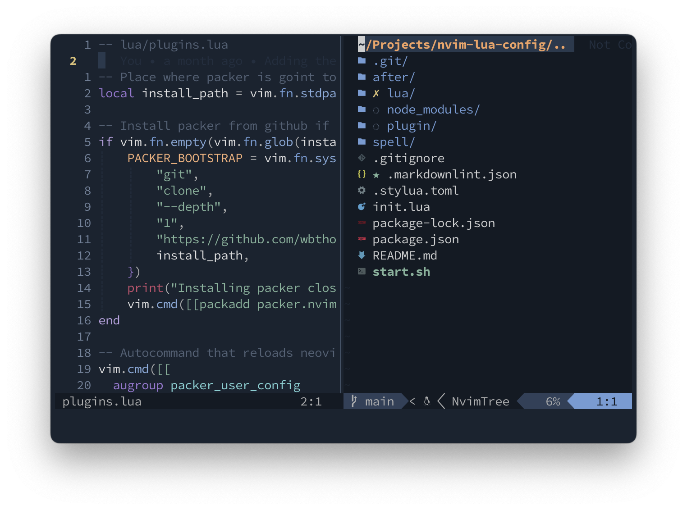

# NeoVim configuration for Modern Web/Mobile Development

Configuring NeoVim for multiple language web development is not an easy task. You have not only to find the right plugin for the job, but you have to set them up in the correct way.

This is a permanent _Work In Progress_.

If you are interested in the rest of my setup, you can visit my [dotfiles repo](https://github.com/marioy47/dotfiles).

**Look at the [keymaps](lua/keymaps.lua) and [commands](lua/commands.lua) files to find out which commands and key maps are available.**

## Requirements

- NeoVim at least version 0.5
- Git
- (Optional) [Stylua](https://github.com/johnnymorganz/stylua) for linting of `.lua` files
- (Optional) [PHPCS and PHPCBF](https://github.com/squizlabs/PHP_CodeSniffer) for PHP linting and formatting
- (Optional) [eslint_d](https://github.com/mantoni/eslint_d.js) for faster JavaScript linting and diagnostics
- (Optional) [markdownlint-cli](https://github.com/igorshubovych/markdownlint-cli) for markdown formatting and linting

## NPM commands

There is a [pacakge.json](package.json) file with commands for linting and formtting the code:

- `npm run lint` will show any lintin errors on the markdown and lua files
- `npm run format` will reformat the markdown and lua files

## TODO

- [ ] Configure language server [using json](https://github.com/tamago324/nlsp-settings.nvim) instead of lua (allows you to have config per-project)
- [ ] Verify it works on React
- [ ] Format does not work with Guttenberg
